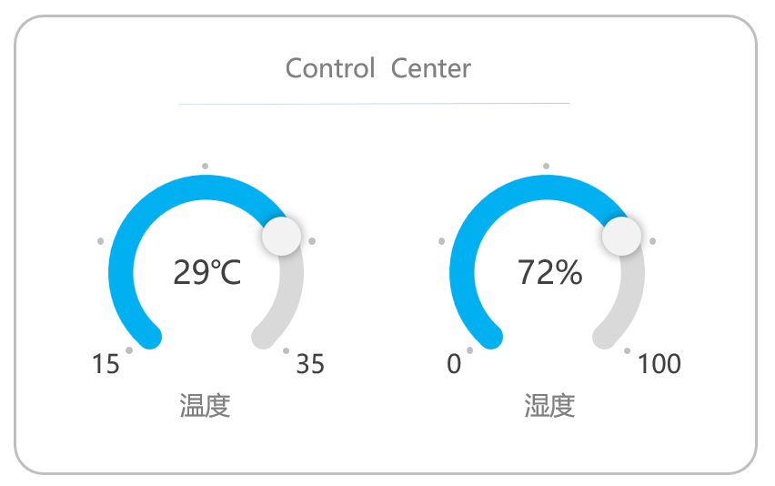
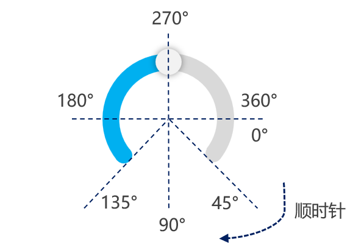

# LVGL 圆弧部件（lv_arc）学习笔记

## 概述
**lv_arc** 是 LVGL 中用于以圆弧形式调节或展示某个参数值的部件。一个圆弧由以下三部分组成：

- **背景弧 (lv_part_main)**
- **前景弧 (lv_part_indicator)**
- **把手 (lv_part_knob)**

通过对这些部分的设置，可以自定义圆弧的外观和交互行为。


---

## 创建和基本设置

### 1. 创建圆弧
```c
lv_obj_t *arc = lv_arc_create(lv_scr_act());
lv_obj_set_size(arc, 200, 200);
lv_obj_align(arc, LV_ALIGN_CENTER, 0, 0);
```
**解释：**
- 使用 `lv_arc_create()` 在当前活动屏幕上创建一个圆弧。
- 设置圆弧的尺寸为 200x200。
- 将圆弧对齐到屏幕中央。

### 2. 设定范围值和当前值
```c
lv_arc_set_range(arc, 0, 100);
lv_arc_set_value(arc, 80);
```
**解释：**
- 使用 `lv_arc_set_range()` 设置圆弧的最小值和最大值，这里设定为 0 到 100。
- 使用 `lv_arc_set_value()` 设置圆弧的当前值为 80。

### 3. 设置背景弧的角度范围

```c
lv_arc_set_bg_angles(arc, 135, 45);
```
**解释：**
- 使用 `lv_arc_set_bg_angles()` 设置背景弧的角度范围。
- 参数为从 135 度到 45 度（以 x 轴正方向为 0 度，逆时针为正方向）。

> **提示：** 如果需要调整前景弧的角度范围，可以使用 `lv_arc_set_angles()` 函数。

---

## 高级功能

### 1. 旋转角度
```c
lv_arc_set_rotation(arc, 0);
```
**解释：**
- 使用 `lv_arc_set_rotation()` 调整整个圆弧部件的旋转角度。
- 参数为顺时针旋转的角度值。

### 2. 模式设置
```c
lv_arc_set_mode(arc, LV_ARC_MODE_SYMMETRICAL);
```
**模式选项：**
- **LV_ARC_MODE_NORMAL**：正常模式，圆弧按正常方向显示。
- **LV_ARC_MODE_SYMMETRICAL**：对称模式，圆弧在中间点对称显示，指示器的起始值在中间。
- **LV_ARC_MODE_REVERSE**：反向模式，圆弧按反方向显示，起始值 0 在最右边，逆时针调整参数值。

### 3. 更改圆弧绘制速率
```c
lv_arc_set_change_rate(arc, 90);
```
**解释：**
- 使用 `lv_arc_set_change_rate()` 设置圆弧的变化速率。
- 参数单位为度/秒。

---

## 获取和交互

### 1. 获取当前值
```c
lv_arc_get_value(arc);
```
**解释：**
- 使用 `lv_arc_get_value()` 获取当前的参数值。

### 2. 添加事件回调函数
```c
static void event_arc_cb(lv_event_t *e)
{
    lv_obj_t *arc = lv_event_get_target(e);
    printf("当前值是：%d\n", lv_arc_get_value(arc));
}
lv_obj_add_event_cb(arc, event_arc_cb, LV_EVENT_VALUE_CHANGED, NULL);
```
**解释：**
- 定义一个回调函数 `event_arc_cb`，当圆弧的值发生变化时被调用。
- 使用 `lv_event_get_target()` 获取事件目标对象。
- 打印当前值。
- 使用 `lv_obj_add_event_cb()` 为圆弧绑定回调函数，当触发 `LV_EVENT_VALUE_CHANGED` 事件时执行。

---

