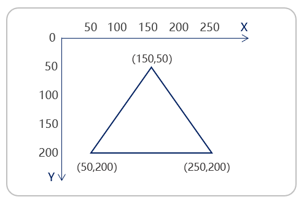

# LVGL 线条部件学习笔记

## 一、基本概念
**lv_line** 是 LVGL 中一个用于画直线的组件。可以在指定坐标直接画制直线，支持交叉和闭合。它的基础构成包括：
- **主体**: 通常是 lv_part_main，包含线条的核心信息和样式设置。


## 二、创建线条
通过 lv_line_create 在基础部件中创建一个线条。

```c
// 创建线条
lv_obj_t *line = lv_line_create(obj);
```

## 三、设置坐标点
在线条中设置坐标点，坐标点依赖于线条部件本身。**(0,0)** 是线条的左上角。

### 代码
```c
// 设置坐标点
static lv_point_precise_t line_point[] = {
    {0, 0},
    {100, 100},
    {100, 0},
    {0, 100},
    {0, 0}};
lv_line_set_points(line, line_point, sizeof(line_point) / sizeof(line_point[0]));
```
### 解释
1. **lv_point_precise_t**: 在 LVGL v9 中，坐标数组的类型为 lv_point_precise_t，在 v8 中为 lv_point_t，需核实版本。
2. **lv_line_set_points**:
   - **参数 2**: 坐标点数组。
   - **参数 3**: 坐标点数量。

## 四、设置线条样式
通过下列函数设置线条的样式：

### 代码
```c
// 设置样式
lv_obj_set_style_line_width(line, 8, LV_PART_MAIN);                      // 设置线条宽度
lv_obj_set_style_line_color(line, lv_color_hex(0x0093F5), LV_PART_MAIN); // 设置线条颜色
lv_obj_set_style_line_rounded(line, true, LV_PART_MAIN);                 // 设置线条圆角
```

### 解释
1. **lv_obj_set_style_line_width**: 设置线条的宽度。
2. **lv_obj_set_style_line_color**: 通过入口颜色值设置线条颜色。
3. **lv_obj_set_style_line_rounded**: 设置线条圆角效果，true 为启用。

## 五、设置 Y 轴翻转
可通过 **lv_line_set_y_invert** 设置 Y 轴翻转。

### 代码
```c
lv_line_set_y_invert(line, true); // 设置 Y 轴翻转
```

### 解释
- **lv_line_set_y_invert**: 设置 Y 轴翻转，true 为启用。

