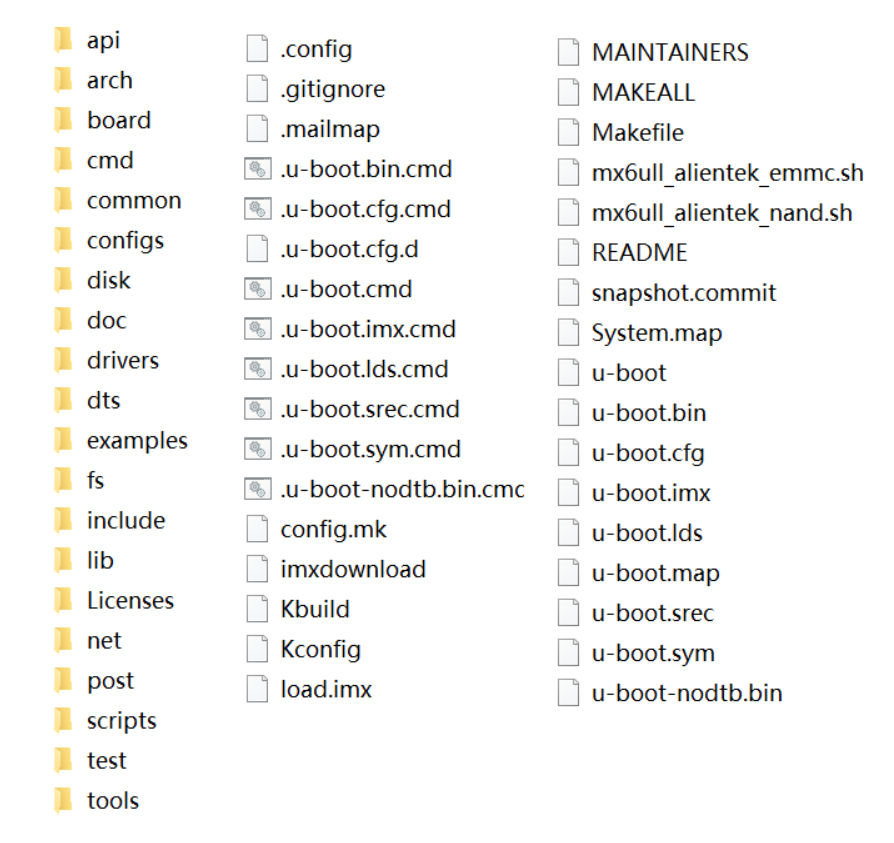
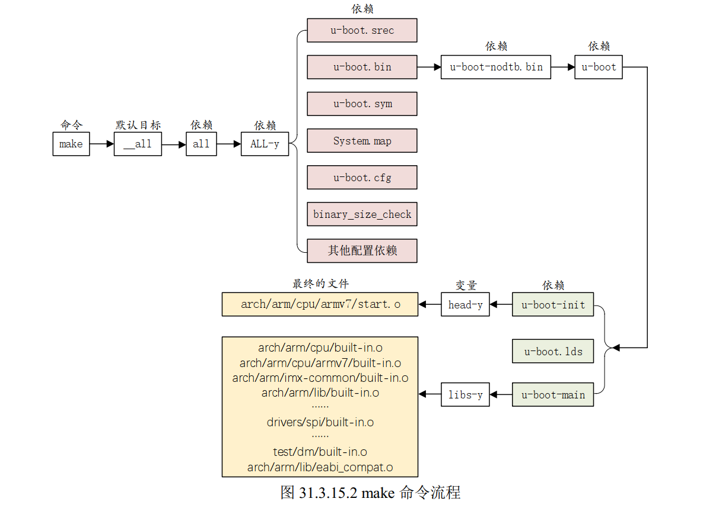

## uboot编译后的内容

其中，以下是编译出的结果：
| 文件名         | 描述 |
|----------------|------|
| System.map     | 系统映射文件 |
| u-boot         | 编译出来的 u-boot 文件。 |
| u-boot.xxx     | 一系列生成的一些 u-boot 相关文件，包括 u-boot.bin、u-boot.imx 等。 |
## 需要关注的内容
### 一、board 文件夹 
**存放开发板相关的内容**，正点原子imx6ull mini开发板相关的内容在`board\freescale\mx6ullevk`目录下，是基于这个目录下的内容开发的，后续在这个板子上移植uboot也要参考这个  
### 二、configs文件夹
**uboot 配置文件** 一般半导体或者开发板厂商都会制作好一个配置文件，我们可以在这个做好的配置文件基础上来添加自己想要的功能  
使用的512M ddr 8G emmc的开发板，对应的defconfig文件是:

    mx6ull_14x14_ddr512_emmc_defconfig
在编译uboot的时候就会调用这个文件

    make ARCH=arm CROSS_COMPILE=arm-linux-gnueabihf- mx6ull_14x14_ddr512_emmc_defconfig
### 三、顶层makefile文件
uboot 源码根目录下的 Makefile 是顶层 Makefile，他会调用其它的模块的 Makefile 文件
### 四、u-boot.xxx文件
| 文件名              | 描述 |
|---------------------|------|
| u-boot              | 编译出来的 ELF 格式的 uboot 镜像文件。 |
| u-boot.bin          | 编译出来的二进制格式的 uboot 可执行镜像文件。 |
| u-boot.cfg          | uboot 的另外一种配置文件。 |
| u-boot.imx          | u-boot.bin 添加头部信息以后的文件，NXP 的 CPU 专用文件。 |
| u-boot.lds          | 链接脚本。 |
| u-boot.map          | uboot 映射文件，通过查看此文件可以知道某个函数被链接到了哪个地址上。 |
| u-boot.srec         | S-Record 格式的镜像文件。 |
| u-boot.sym          | uboot 符号文件。 |
| u-boot-nodtb.bin    | 和 u-boot.bin 一样，u-boot.bin 就是 u-boot-nodtb.bin 的复制文件。 |
### 五、.config文件
uboot 配置文件，使用命令`make xxx_defconfig`配置 uboot 以后就会自动生成  
内容基本都是以`CONFIG_`开始的配置项，就是makefile中的变量。  
.config 中会有大量的变量值为`y`，这些为`y`的变量一般用于控制某项功能是否使能，为`y`的话就表示功能使能，如：

        CONFIG_CMD_BOOTM=y

## 顶层Makefile分析  
