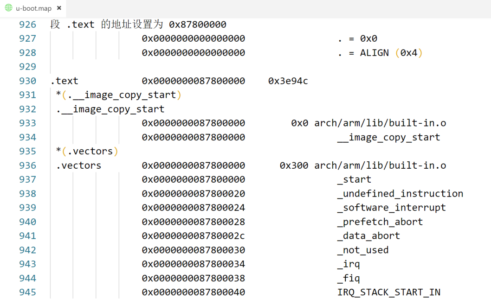

# 一、uboot链接分析
## 1、链接脚本 u-boot.lds
程序的链接是由链接脚本来决定的，所以通过链接脚本可以找到程序的入口。编译后在uboot根目录找到`u-boot.lds`

    OUTPUT_FORMAT("elf32-littlearm", "elf32-littlearm", "elf32-littlearm")
    OUTPUT_ARCH(arm)
    ENTRY(_start)
    SECTIONS
    {
    . = 0x00000000;
    . = ALIGN(4);
    .text :
    {
    *(.__image_copy_start)
    *(.vectors)
    arch/arm/cpu/armv7/start.o (.text*)
    *(.text*)
    }

可以看到代码当前入口点： `_start`。  `_start` 在文件 `arch/arm/lib/vectors.S` 中有定义  
## 2、内存的段（Section）与中断向量表
在程序编译后，生成的目标文件（如 ELF 文件）中，程序的代码和数据被组织成不同的段（section）。这些段通常根据用途进行划分，比如：
- .text：存放程序的代码。
- .data：存放已初始化的全局变量和静态变量。
- .bss：存放未初始化的全局变量和静态变量。
- .rodata：存放只读数据，如字符串常量。
- .vectors：通常是用户自定义的一个段，用于存储特殊用途的数据或代码，比如中断向量表。

**中断向量表**  
`.vectors`段通常用于嵌入式系统中，作为中断向量表或异常向量表存储的区域。中断向量表是处理器在响应中断或异常时需要查找的地址表，包含了一系列中断服务程序（ISR）的入口地址。   
`.vectors` 段通常被链接到内存中的一个固定地址，处理器会根据这个固定地址去查找中断向量。
## 3、uboot 的起始地址 0X87800000  
`arch/arm/lib/vectors.S`中，有：

    .section ".vectors", "ax"
_start后面就是中断向量表，`.section ".vectors", "ax"`表示将这段代码存放在.vectors 段里面。  
`u-boot.lds`文件中关于`.text`段：

    .text :
    {
    *(.__image_copy_start)
    *(.vectors)
    arch/arm/cpu/armv7/start.o (.text*)
    *(.text*)
    }
### 在uboot映射中找.text和.vectors段的地址
（u-boot.map 是 uboot 的映射文件，可以从此文件看到某个文件或者函数链接到了哪个地址）  
在`u-boot.map`中查找`.text`和`.vectors`，有：  

可以看出.text、.vectors的起始地址都是**0X87800000**
## 4、uboot 相关变量  
在链接脚本 u-boot.lds还规定了下面这些变量：
| 变量名              | 地址          | 描述 |
|---------------------|---------------|------|
| __image_copy_start  | 0x87800000    | uboot 拷贝的首地址 |
| __image_copy_end    | 0x8785dd54    | uboot 拷贝的结束地址 |
| __rel_dyn_start     | 0x8785dd54    | .rel.dyn 段起始地址 |
| __rel_dyn_end       | 0x878668f4    | .rel.dyn 段结束地址 |
| _image_binary_end   | 0x878668f4    | 镜像结束地址 |
| __bss_start         | 0x8785dd54    | .bss 段起始地址 |
| bss_end             | 0x878a8e74    | .bss 段结束地址 |

# 二、U-Boot 启动流程