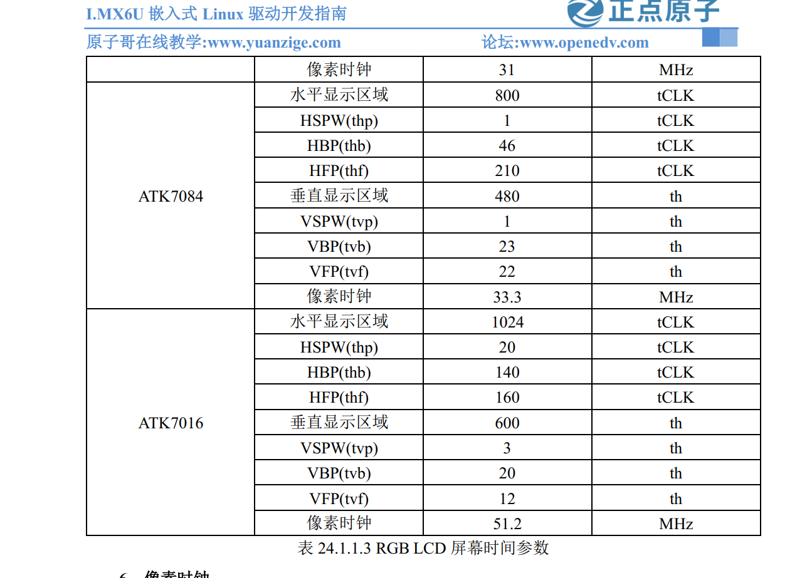

半导体厂商会将 uboot 移植到他们自己的原厂开发板上，uboot 移植的一般流程：
- 在 uboot 中找到参考的开发平台，一般是原厂的开发板
- 参考原厂开发板移植 uboot 到我们所使用的开发板上
### 一、编译官方开发板的uboot
#### 1、将官方uboot放到Ubuntu中并解压
#### 2、在.configs文件中找到对应芯片的defconfig文件：

    mx6ull_14x14_evk_emmc_defconfig
#### 3、执行编译命令  
和编译正点原子官方uboot时相同，使用以下命令：

    make ARCH=arm CROSS_COMPILE=arm-linux-gnueabihf- mx6ull_14x14_evk_emmc_defconfig
    make V=1 ARCH=arm CROSS_COMPILE=arm-linux-gnueabihf- -j16
在编译的时候需要指定架构和交叉编译工具，可以直接在makefile中给ARCH和CROSS_COMPILE这两个变量赋值，如下：

    //250行左右
    # set default to nothing for native builds
    ifeq ($(HOSTARCH),$(ARCH))
    CROSS_COMPILE ?=
    endif
    ARCH = arm
    CROSS_COMPILE = arm-linux-gnueabihf-

    KCONFIG_CONFIG	?= .config
    export KCONFIG_CONFIG
这样可以直接执行下面的指令来编译，而不用指定架构和教程编译工具

    make mx6ull_14x14_evk_emmc_defconfig
    make V=1 -j16

或者可以直接搞个脚本来便捷编译，参考[编译开发板的uboot.md](./2-编译开发板的uboot.md)

#### 4、烧写验证与驱动测试
烧写进开发板，参考[用SD卡烧写程序.md](../用SD卡烧写程序.md)  
编译好的nxp的uboot可以直接在 I.MX6ULL 开发板上是正常启动
##### 驱动检测
检测两个mmc设备（sd卡和emmc）驱动正常
### 二、在 U-Boot 中添加自己的开发板
#### 1、添加开发板默认配置文件
复制nxp开发板的defconfig

    cp mx6ull_14x14_evk_emmc_defconfig mx6ull_alientek_emmc_defconfig  
打开`mx6ull_alientek_emmc_defconfig`，修改为：

    CONFIG_SYS_EXTRA_OPTIONS="IMX_CONFIG=board/freescale/mx6ull_alientek_emmc/imximage.cfg,MX6ULL_EVK_EMMC_REWORK"
    CONFIG_ARM=y
    CONFIG_ARCH_MX6=y
    CONFIG_TARGET_MX6ULL_ALIENTEK_EMMC=y
    CONFIG_CMD_GPIO=y
#### 2、添加开发板对应的头文件
在`include/configs`中复制`mx6ullevk.h`为`mx6ull_alientek_emmc.h`，修改预编译ifndef、define为 ` __MX6ULL_ALIENTEK_EMMC_CONFIG_H`。  
`mx6ull_alientek_emmc.h` 里面有很多宏定义，这些宏定义基本用于配置 uboot，也有一些
I.MX6ULL 的配置项目，如果我们自己要想使能或者禁止 uboot 的某些功能，那就在mx6ull_alientek_emmc.h 里面做修改即可。
`mx6ull_alientek_emmc.h`文件中基本都是`CONFIG_`开头
的宏定义，这也说明 `mx6ull_alientek_emmc.h` 文件的主要功能就是配置或者裁剪 uboot。  
**如果需要某个功能的话就在里面添加这个功能对应的 CONFIG_XXX 宏即可，如果不需要某个功能的话就删除掉对应的宏即可**
#### 3、头文件中常用的配置宏
1. 设置DRAM大小
    ```c
    #ifdef CONFIG_TARGET_MX6ULL_9X9_EVK
    #define PHYS_SDRAM_SIZE		SZ_256M
    #define CONFIG_BOOTARGS_CMA_SIZE   "cma=96M "
    #else
    #define PHYS_SDRAM_SIZE		SZ_512M
    #define CONFIG_BOOTARGS_CMA_SIZE   ""
    ```
2. uboot 启动的时候可以输出 CPU 信息

        #define CONFIG_DISPLAY_CPUINFO
3. uboot 启动的时候可以输出板子信息

        #define CONFIG_DISPLAY_BOARDINFO
4. 使能 I.MX6ULL 的串口功能

        #define CONFIG_MXC_UART
        #define CONFIG_MXC_UART_BASE		UART1_BASE 
    宏 CONFIG_MXC_UART_BASE 表示串口寄存器基地址，这里使用的串口 1，基地址为 UART1_BASE
5. 配置EMMC

        /* MMC Configs */
        #ifdef CONFIG_FSL_USDHC
        #define CONFIG_SYS_FSL_ESDHC_ADDR	USDHC2_BASE_ADDR
6. 配置IIC

        /* I2C configs */
        #define CONFIG_CMD_I2C
        #ifdef CONFIG_CMD_I2C
        #define CONFIG_SYS_I2C
        #define CONFIG_SYS_I2C_MXC
        #define CONFIG_SYS_I2C_MXC_I2C1		/* enable I2C bus 1 */
        #define CONFIG_SYS_I2C_MXC_I2C2		/* enable I2C bus 2 */
        #define CONFIG_SYS_I2C_SPEED		100000
7. 设置系统时钟频率

        #define CONFIG_SYS_LOAD_ADDR		CONFIG_LOADADDR
        #define CONFIG_SYS_HZ			1000
8. 设置栈大小

        #define CONFIG_STACKSIZE		SZ_128K
#### 4、添加开发板对应的板级文件夹BSP  
**uboot 中每个板子都有一个对应的文件夹来存放板级文件，比如开发板上外设驱动文件等等**，在`board/freescale`目录下  
复制nxp官方板子的`mx6ullevk`，将其重命名为 `mx6ull_alientek_emmc`，进入目录将`mx6ullevk.c`重命名为`mx6ull_alientek_emmc.c`

    cd mx6ull_alientek_emmc
    mv mx6ullevk.c mx6ull_alientek_emmc.c
复制重命名工程后，要修改一系列配置文件，基本都是该文件名
- 修改Makefile
- 修改imximage.cfg
- 修改Kconfig
- 修改MAINTAINERS
- 修改 U-Boot 图形界面配置文件    

参考正点原子Linux驱动开发指南870页  

#### 5、编译下载uboot
参考[编译开发板的uboot.md](./2-编译开发板的uboot.md)和[用SD卡烧写程序.md](../用SD卡烧写程序.md)
### 三、修改硬件外设驱动
#### 1、修改lcd驱动
在`board/freescale/mx6ull_alientek_emmc`中找`mx6ull_alientek_emmc.c`  
参考

像素时钟需要计算

修改为：

    struct display_info_t const displays[] = {{
	.bus = MX6UL_LCDIF1_BASE_ADDR,
	.addr = 0,
	.pixfmt = 24,
	.detect = NULL,
	.enable	= do_enable_parallel_lcd,
	.mode	= {
		.name			= "TFT7084",
		.xres           = 800,
		.yres           = 480,
		.pixclock       = 30030,
		.left_margin    = 46,         //HBPD
		.right_margin   = 210,		  //HFPD
		.upper_margin   = 23,		  //VBPD
		.lower_margin   = 22,		  //VFPD
		.hsync_len      = 1,		  //HSPW
		.vsync_len      = 1,		  //VSPW
		.sync           = 0,
		.vmode          = FB_VMODE_NONINTERLACED
    } } };
再在头文件中修改panel=TFT7084
#### 2、添加以太网口驱动
#### 3、其他需要修改的地方