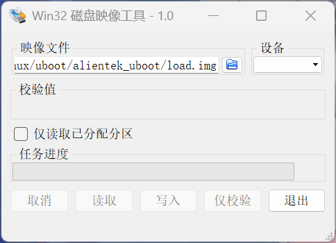

## 概述
如果要用sd卡来启动程序，程序存放的方式要符合nxp的规定，这里使用正点原子的**imxdownload**程序来用sd卡烧写程序。但wsl2默认没有其他存储设备驱动，要挂载sd卡来烧录要重新编译wsl2内核，因此通过修改正点原子imxdownload，让它打包bin文件为img镜像，在Windows上用工具来烧录进sd卡。
## 一、在Ubuntu下重新编译imxdownload
在`5、开发工具->2、Ubuntu 下裸机烧写软件->imxdownload`中找到imxdownload.c和.h，放到工作路径下，修改imxdownload.c，为：
```c
#include "stdio.h"
#include "stdlib.h"
#include "string.h"
#include "imxdownload.h"
 
#define SHELLCMD_LEN    (200)
#define BIN_OFFSET      (3072)
#define SD_BIN_OFFSET   (1024)
#define BIN_OFFSET2     (BIN_OFFSET+SD_BIN_OFFSET)
 
/* 此宏指明是否打印u-boot.imx的IVT DCD表信息，不同的开发板其IVT和DCD
 * 表的数据是不同的，因此需要获取所使用的开发板的IVT和DCD表信息，最
 * 简单的方法就是读取开发板配套资料里面的u-boot.imx的前1KB数据，理论上
 * 应该读取3KB的数据，但是表信息远远没有3K这么多，因此读1KB即可 
 */
#define PRINT_TAB       0   
/*
 * 介绍： 此软件是针对NXP的IMX6U系列芯片的，软件用来烧写bin文件到SD卡里面，
 *        本软件会自动添加IVT、DCD等信息到原始的bin文件里面，主要用于裸机和uboot的烧写。
 * 使用方法： 1、编译好原始的二进制bin文件，如，u-boot.bin等，并将编译好的.bin文件和本
 *             软件放置到同一个目录下！！！！
 *          2、执行命令sudo ./imxdownload <soucre_bin> <sd_device>
 *             如烧写u-boot.bin到/dev/sdd中即可使用如下所示命令:
 *             sudo ./imxdownload u-boot.bin /dev/sdd
 */
 
/*
 * 输出一些信息
 */
void message_print(void)
{   
    printf("I.MX6ULL bin merge software\r\n");
    printf("Edit by:trueLink\r\n");
    printf("Date:2022/11/26\r\n");
    printf("Version:V1.0\r\n");
    printf("log:V1.0 initial version,support 256MB、512MB DDR3\r\n");
}
 
int main(int argc, char *argv[])
{
    FILE *fp;
    unsigned char *buf,*buf2;
    unsigned char *cmdbuf;
    int nbytes, filelen;
    int i = 0, j = 0;
    int ddrsize = 0; /* 0为512MB，1为256MB，2为128MB...... */
 
    message_print();
 
    if((argc != 2) && (argc != 3)){
        printf("Error Usage! Reference Below:\r\n");
        printf("sudo ./%s <-512m or -256m> <source_bin> \r\n", argv[0]);
        return -1;
    }
 
    /* 查找参数，获取DDR容量 */
    for(i = 0; i < argc; i++)
    {
        char *param = argv[i];
        if(param[0] != '-')
            continue;
        if(strcmp(param, "-256m") == 0)         /* 256MB */
            ddrsize = 1;
        else if(strcmp(param, "-512m") == 0)    /* 512MB */
            ddrsize = 0;
    }
    if(argc == 2)   /* 三个参数，也就是不输入DDR容量的话默认为512MB */
        ddrsize = 0;
 
    /* 打开bin文件 */
    fp = fopen(argv[1], "rb"); /* 以二进制只读方式打开bin文件 */
    if(fp == NULL){
        printf("Can't Open file %s\r\n", argv[1]);
        return -1;
    }
    
    /* 获取bin文件长度 */
    fseek(fp, 0L, SEEK_END);
    filelen = ftell(fp);
    fseek(fp, 0L, SEEK_SET);
    printf("file %s size = %dBytes\r\n", argv[1], filelen);
    
    /* 读取bin文件到缓冲区buf中 */
    buf = malloc(filelen + BIN_OFFSET);
    if(buf == NULL){
        printf("Mem Malloc Failed!\r\n");
        free(buf);
        fclose(fp);
        return -1;
    }
    memset(buf, 0, filelen + BIN_OFFSET); /* 清零 */
    /* 读取bin源码文件 */
    fread(buf + BIN_OFFSET, 1, filelen, fp);
    /* 关闭文件 */
    //fclose(fp);       //buf2
    //buf2///
    buf2 = malloc(filelen + BIN_OFFSET2);
    if(buf2 == NULL){
        printf("Mem Malloc Failed!\r\n");
        free(buf2);
        fclose(fp);
        return -1;
    }
    memset(buf2, 0, filelen + BIN_OFFSET2); /* 清零 */
    /* 复制bin源码文件 */
    memcpy(buf2 + BIN_OFFSET2, buf + BIN_OFFSET, filelen);
    /* 关闭文件 */
    fclose(fp);
 
#if PRINT_TAB
    printf("IVT DCD Table:\r\n");
    for(i = 0; i < 1024/32; i++){
        for(j = 0; j < 8; j++)
        {
            printf("0X%08X,",*(int *)(buf + BIN_OFFSET + (((i * 8) + j) * 4)));
        }
        printf("\r\n");
    }   
    free(buf);
    return 0;
#endif
    
    /* 添加IVT DCD等表信息到bin文件里面 */
    if(ddrsize == 0) {      /* 512MB */
        printf("Board DDR SIZE: 512MB\r\n");
        memcpy(buf, imx6_512mb_ivtdcd_table, sizeof(imx6_512mb_ivtdcd_table));
    }
    else if (ddrsize == 1) {    /* 256MB */
        printf("Board DDR SIZE: 256MB\r\n");
        memcpy(buf, imx6_256mb_ivtdcd_table, sizeof(imx6_256mb_ivtdcd_table));
    }
 
    /* 现在我们已经在buf中构建好了可以用于下载的bin文件，将buf中的数据保存到
     * 到一个文件中，文件命名为load.imx
     */
    printf("Delete Old load.imx\r\n");
    system("rm -rf load.imx");      /* 先删除旧的load.imx文件  */
    
    printf("Create New load.imx\r\n");
    system("touch load.imx");       /* 创建新的load.imx文件       */
    fp = fopen("load.imx", "wb");   /* 打开laod.imx               */
    if(fp == NULL){
        printf("Cant't Open load.imx!!!\r\n");
        free(buf);
        fclose(fp);
        return -1;
    }
    nbytes = fwrite(buf, 1, filelen + BIN_OFFSET, fp);
    if(nbytes != (filelen + BIN_OFFSET)){
        printf("File Write Error!\r\n");
        free(buf);
        fclose(fp);
        return -1;
    }
    printf("load.imx is complete.\r\n");
    free(buf);
    fclose(fp); 
 
    //buf2///
    /* 添加IVT DCD等表信息到bin文件里面 */
    if(ddrsize == 0) {      /* 512MB */
        printf("Board DDR SIZE: 512MB\r\n");
        memcpy(buf2+SD_BIN_OFFSET, imx6_512mb_ivtdcd_table, sizeof(imx6_512mb_ivtdcd_table));
    }
    else if (ddrsize == 1) {    /* 256MB */
        printf("Board DDR SIZE: 256MB\r\n");
        memcpy(buf2+SD_BIN_OFFSET, imx6_256mb_ivtdcd_table, sizeof(imx6_256mb_ivtdcd_table));
    }
    //新建一个可直接烧录到SD的bin文件  load.bin
    printf("Delete Old load.img\r\n");
    system("rm -rf load.img");      /* 先删除旧的load.img    */
    
    printf("Create New load.img\r\n");
    system("touch load.img");       /* 创建新的load.img     */
    fp = fopen("load.img", "wb");   /* 打开laod.img               */
    if(fp == NULL){
        printf("Cant't Open load.img!!!\r\n");
        free(buf2);
        fclose(fp);
        return -1;
    }
    nbytes = fwrite(buf2, 1, filelen + BIN_OFFSET2, fp);
    if(nbytes != (filelen + BIN_OFFSET2)){
        printf("File Write Error!\r\n");
        free(buf2);
        fclose(fp);
        return -1;
    }
    printf("load.bin is complete.\r\n");
    free(buf2);
    fclose(fp);     
    
    //屏蔽烧录命令
    /* 构建烧写的shell命令 */
    // cmdbuf = malloc(SHELLCMD_LEN);
    // sprintf(cmdbuf, "sudo dd iflag=dsync oflag=dsync if=load.imx of=%s bs=512 seek=2",argv[2]);  
    // printf("Download load.imx to %s  ......\r\n", argv[2]);
    
    // /* 执行上面的shell命令 */
    // system(cmdbuf);
    // free(cmdbuf);
    return 0;   
}
```
编译出新的imxdownload执行文件

    gcc imxdownload.c -o imxdownload2 

## 二、用imxdownload2打包要烧录的bin文件
将imxdownload2放置到要烧录bin文件的路径下  
给imxdownload2可执行权限（只用执行一遍）

    chmod 777 imxdownload2  
打包bin文件为load.img  

    如要打包led.bin
    ./imxdownload2 led.bin  
## 三、在windows上使用工具将img烧录到sd卡
参考下图：  
