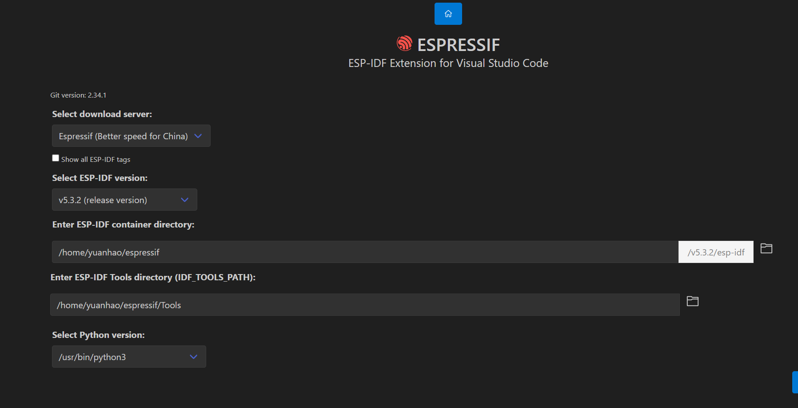
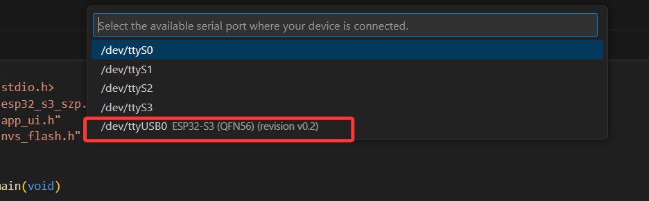

### 1、安装依赖库  

        sudo apt-get install git wget flex bison gperf python3 python3-pip python3-venv cmake ninja-build ccache libffi-dev libssl-dev dfu-util libusb-1.0-0  

### 2、通过ESP-IDF插件将espidf部署到wsl2的Ubuntu中    
- 安装ESP-IDF插件到工作区
- 点击左边栏插件，Advancde -> Configure ESP-IDF Extension -> EXPRESS
- 按照图片选择部署路径：
  
### 3、使用USBIPD将USB设备共享给WSL2  
1. 在windows的powershell中安装**USBIPD**，安装后重启powershell

        winget install usbipd //开代理，要从GitHub上下载

2. 找到esp32对应的设备，记住BUSID，如：6-4

        usbipd list //列出当前usb设备

        6-4    1a86:7522  USB-SERIAL CH340K (COM3)                                      Not shared
3. 绑定BUSID，运行它被共享到WSL2

        usbipd bind --busid <BUSID>
        如：
        usbipd bind --busid 6-4
4. 将USB设备附加到WSL2

        usbipd attach --wsl --busid <BUSID>
        如：
        usbipd attach --wsl --busid 6-4
5. 运行结果：

        PS C:\Users\20541> usbipd attach --wsl --busid 6-4
        usbipd: info: Using WSL distribution 'Ubuntu' to attach; the device will be available in all WSL 2 distributions.
        usbipd: info: Using IP address 127.0.0.1 to reach the host.
6. 在Ubuntu上运行`lsusb`，可以看到多出一个沁恒（ch343）`QinHeng`的设备

        Bus 002 Device 001: ID 1d6b:0003 Linux Foundation 3.0 root hub
        Bus 001 Device 002: ID 1a86:7522 QinHeng Electronics USB Serial
        Bus 001 Device 001: ID 1d6b:0002 Linux Foundation 2.0 root hub
7. 在espidf插件中选择串口，选择共享usb设备：

**注意事项**  

- usb设备共享后，每次拔插数据线或esp32，都需要重新执行`把usb设备附加到WSL2`这一步：  
可以先执行`usbipd list`查看设备是否在`shared`状态

        usbipd attach --wsl --busid 6-4