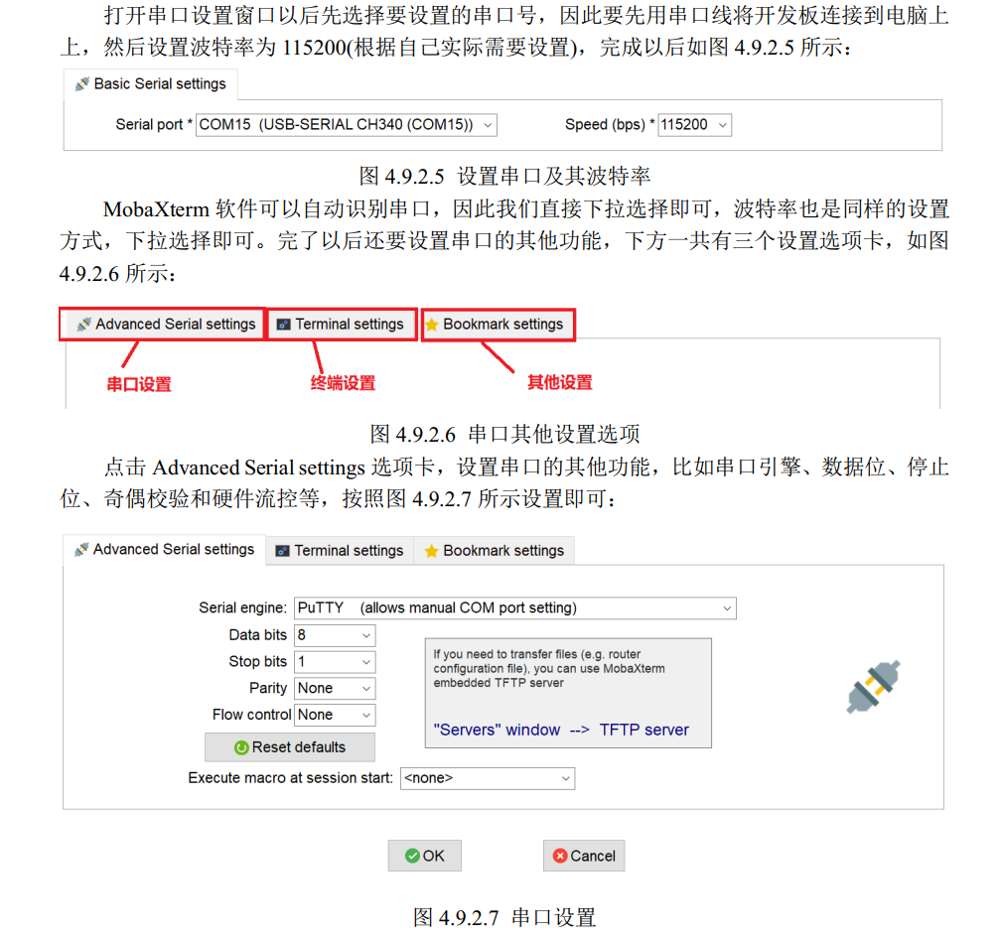

### 一、安装Ubuntu上的交叉编译工具 Linaro GCC
1. 下载4.9版本的编译器，网址：

        https://releases.linaro.org/components/toolchain/binaries/4.9-2017.01/arm-linux-gnueabihf/  
2. 找到64位X86架构Linux系统对应的编译器：

        gcc-linaro-4.9.4-2017.01-x86_64_arm-linux-gnueabihf.tar.xz  
3. 在Ubuntu根目录中创建`/linux/tool`来存放编译器，直接用wsl2文件共享功能权限不够，可以先放在用户文件夹下，再用sudo cp复制，如：

        sudo cp gcc-linaro-4.9.4-2017.01-x86_64_arm-linux-gnueabihf.tar.xz /linux/tool
4. 创建`/usr/local/arm`，将交叉编译器复制到这个目录中：

        sudo mkdir /usr/local/arm
        sudo cp gcc-linaro-4.9.4-2017.01-x86_64_arm-linux-gnueabihf.tar.xz /usr/local/arm/ -f  
5. 在/usr/local/arm 目录中对交叉编译工具进行解压 

        sudo tar -vxf gcc-linaro-4.9.4-2017.01-x86_64_arm-linux-gnueabihf.tar.xz
6. 修改环境变量，**将交叉编译工具放置到环境变量中**

        sudo vim /etc/profile 

        在后面添加：
        export PATH=$PATH:/usr/local/arm/gcc-linaro-4.9.4-2017.01-x86_64_arm-linux-gnueabihf/bin  
7. 重启Ubuntu系统  

8. 安装其他库

        sudo apt-get install lsb-core lib32stdc++6
9. 验证版本

        arm-linux-gnueabihf-gcc -v
        得到下面内容，表示交叉编译工具安装成功：
        gcc version 4.9.4 (Linaro GCC 4.9-2017.01) 

### 二、开发板的调试
1. **串口调试**，使用MobaXterm，串口配置如下：

2. **ssh调试**，使用MobaXterm或vscode